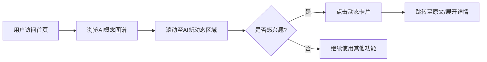

# AI-Aides "AI新动态"模块 PRD

## 1. 产品概述

在现有AI概念图谱首页基础上，新增"AI新动态"信息流模块，用于展示每日/近期AI领域的最新资讯、技术突破、行业动态等内容，帮助用户快速获取AI领域的前沿信息。

- **目标用户**：AI学习者、开发者、研究人员、对AI感兴趣的普通用户
- **核心价值**：一站式获取AI领域最新动态，与概念图谱形成知识+资讯的完整学习闭环

## 2. 核心功能

### 2.1 功能模块

1. **首页集成**：在现有图谱页面下方或侧边新增"AI新动态"卡片区域
2. **动态列表**：以时间线/卡片形式展示AI新闻动态
3. **分类筛选**：支持按类型（技术突破、行业应用、学术研究、工具发布等）筛选
4. **详情查看**：点击可查看动态摘要及原文链接

### 2.2 页面功能明细

| 页面名称 | 模块名称 | 功能描述 |
|---------|---------|---------|
| 首页 | AI新动态区域 | 展示最新6-8条AI动态，支持横向滚动或网格布局 |
| 首页 | 动态卡片 | 包含标题、摘要、来源、时间、分类标签、原文链接 |
| 首页 | 筛选器 | 按分类标签快速过滤动态内容 |

## 3. 核心流程

## 4. 用户界面设计

### 4.1 设计风格

- **主色调**：延续现有配色体系（紫色#5B5FC7为主色）
- **辅助色**：
  - 技术突破：绿色 #00D084
  - 行业应用：蓝色 #0EA5E9
  - 学术研究：橙色 #F59E0B
  - 工具发布：粉色 #EC4899
- **按钮样式**：圆角胶囊形，悬浮变色效果
- **字体**：系统默认中文字体栈（-apple-system, BlinkMacSystemFont, 'Segoe UI'等）
- **布局风格**：卡片式布局，与现有图谱区域视觉统一

### 4.2 页面设计概览

| 页面名称 | 模块名称 | UI元素说明 |
|---------|---------|-----------|
| 首页 | 新动态标题区 | 标题"📡 AI新动态"、副标题描述、查看更多链接 |
| 首页 | 动态卡片列表 | 网格/横向滚动布局，每张卡片包含：分类标签、标题（2行截断）、摘要（3行截断）、来源标识、发布时间、阅读量/热度指标 |
| 首页 | 分类筛选栏 | 标签式筛选按钮组，支持多选或单选切换 |
| 首页 | 空状态/加载状态 | 骨架屏loading动画、暂无数据提示 |

### 4.3 响应式设计

- **桌面端（>1024px）**：3-4列网格布局，卡片宽度均匀分布
- **平板端（768px-1024px）**：2列网格布局
- **移动端（<768px）**：单列堆叠布局，支持左右滑动浏览

### 4.4 动效设计

- 卡片悬浮时轻微上浮（translateY: -4px）+ 阴影加深
- 入场时采用staggered reveal动画（依次淡入上移）
- 分类标签切换时有平滑过渡效果
- 加载状态使用pulse骨架屏动画
