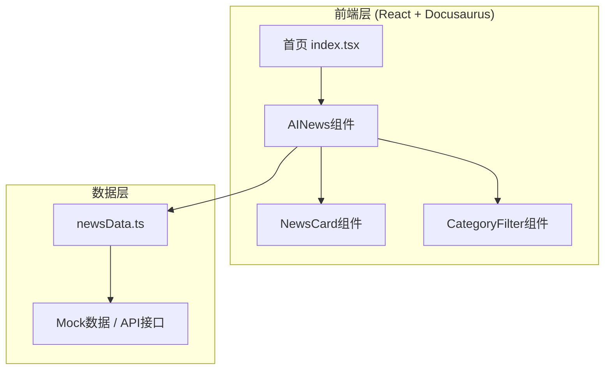

# AI-Aides "AI新动态"模块 技术架构文档

## 1. 架构设计



## 2. 技术选型

* **前端框架**：React 18 + TypeScript（基于现有Docusaurus项目）

* **样式方案**：CSS Modules（与现有项目保持一致）

* **构建工具**：Docusaurus内置构建系统

* **数据源**：初期使用Mock数据，预留API接口对接能力

* **图标方案**：Emoji + CSS实现（轻量化）

## 3. 组件结构

| 路由/位置 | 组件名              | 职责              |
| ----- | ---------------- | --------------- |
| 首页    | `AINewsSection`  | 新动态模块容器，管理状态和数据 |
| 首页    | `NewsCard`       | 单条动态卡片组件        |
| 首页    | `CategoryFilter` | 分类筛选器组件         |
| 数据层   | `newsData.ts`    | Mock数据定义和类型导出   |

## 4. 数据模型定义

### 4.1 TypeScript 类型定义

```typescript
interface NewsItem {
  id: string;
  title: string;
  summary: string;
  category: 'tech-breakthrough' | 'industry' | 'research' | 'tool-release';
  source: string;
  sourceUrl: string;
  publishDate: string; // ISO格式
  readCount?: number;
  imageUrl?: string;
  tags?: string[];
}

interface NewsCategory {
  id: string;
  name: string;
  color: string;
}
```

### 4.2 Mock数据结构

提供8-12条示例新闻数据，涵盖：

* 大模型更新（GPT、Claude、Gemini等）

* AI框架/工具发布

* 重要学术论文

* 行业应用案例

* 政策法规动态

## 5. 文件结构

```
aides/src/
├── components/
│   └── AINews/
│       ├── index.tsx           # 主组件入口
│       ├── AINews.module.css   # 样式文件
│       ├── NewsCard.tsx        # 新闻卡片组件
│       └── CategoryFilter.tsx  # 分类筛选组件
├── data/
│   └── newsData.ts            # Mock数据和类型定义
├── pages/
│   └── index.tsx              # 首页（需集成新模块）
```

## 6. 集成方式

在现有首页`index.tsx`的`GraphCanvas`组件下方插入`AINewsSection`组件，形成：

```
┌─────────────────────────────┐
│     Header & Controls       │
│  （标题、搜索、分类筛选）     │
├─────────────────────────────┤
│                             │
│      GraphCanvas            │
│      （概念关系图谱）         │
│                             │
├─────────────────────────────┤
│   📡 AI新动态               │
│  ┌─────┬─────┬─────┐       │
│  │Card │Card │Card │       │
│  └─────┴─────┴─────┘       │
└─────────────────────────────┘
```

## 7. 性能考虑

* 初始渲染仅显示前6条数据，采用懒加载策略

* 图片使用placeholder占位，按需加载

* 分类筛选在前端完成，无需请求后端

* 预留虚拟滚动接口，应对未来大量数据场景

